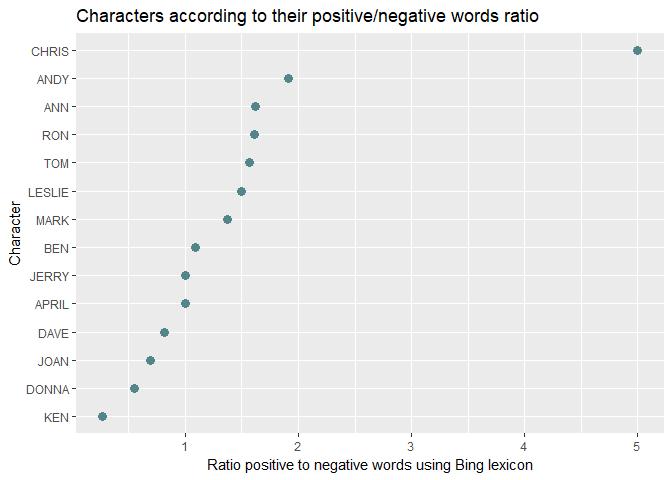

Sometimes you dream big, but you just don't have the data...  
I had this plan for text analysis by character from the Parks &
Recreation series to celebrate Galantine's Day but getting the data was
a struggle. Subtitles are available for pretty much every episode but
those don't contain data about the character who said the lines. I
needed scripts, which are a bit harder to come by. I found 6 scripts of
episodes scattered on the web from the first 3 seasons in pdf format
that were usable.  
That's not even covering 5% of the series episodes, but let's use what
we've got!

But first, what is Galantine's day I hear you ask?
<https://media.giphy.com/media/l3q2tpNX0icJxe87K/giphy.gif>

Seriously? It's only like the best day ever!
<https://media.giphy.com/media/qjXuMQ4TTaDSg/giphy.gif>

On Friday February 13th, the day before Valentine, Leslie Knope from the
Pawnee Parks department celebrates Galentine's day with her... gals.

Extracting the data from pdf
----------------------------

    library(pdftools)
    library(stringr)
    library(dplyr)
    library(tidyr)

    #getting the data from pdf
    pdf_script <- pdf_text("data/parks-and-recreation-3x07-harvest-festival-2011.pdf")

    #remove the first two pages that are cover sheets
    pdf_script <- pdf_script[3:34]

 

As per usual, getting the data in good shape took quite a bit of effort
and regex-playtime, but as this won't be very interesting, I will
quickly glance past it.

I needed to extract pdf's 6 times, so I did the first one manually and
then turned this into a function: The function does a few things in a
row:

-   It removes the recurring text on top of the pdfs which contains the
    episode information
-   It extracts only the indented text which is where the actual lines
    are. Everything else is descriptions of characters/scenes.
-   It removes some other text like "ACT ONE", "END OF SHOW". It also
    removes anything between brackets which was often to indicate a
    character's reaction like "(shouting)".
-   After moving it into one long vector, I could split the text into
    lines by character. This was possible because the character's name
    was all in uppercase and no other text was.
-   And finally moves everything in a dataframe

<!-- -->

    clean_pr_script <- function(pdf_script, episodeinfo){
      
      indented_text <- pdf_script %>%
        #removing the first lines on every page that are just title text
        str_replace("PARKS.+\\\r\\n.+10", "") %>% 
        #extracting on the indented text
        str_extract_all(pattern = "\r\n\\s{5,}.+") %>%
        unlist()

      
      clean_indented_text <- indented_text %>%
        str_replace("(END OF )?COLD OPEN", "") %>%  
        str_replace("(END OF )?ACT [A-Z]+", "") %>%  
        str_replace("TAG", "") %>%
        str_replace("END OF SHOW", "") %>%  
        str_replace("\\(.+\\)", "") %>%  #removes anything between brackets
        str_replace("\r\n\\s+", "")  #removes the new line and extra spaces 
      
      #pasting into one long text
      one_long_text <- paste(clean_indented_text, collapse = " ")
      
      #splitting by speaker
      clean_script <- str_extract_all(one_long_text, "[A-Z]{3,}(\\s*\\W*[A-Z]?\\W*[a-z]+\\W*\\d*)+")  
      clean_script <- unlist(clean_script)
      
      
      #making a dataframe
      script_split <- str_split(clean_script, pattern = " ", n=2)
      script_split_t <- purrr::transpose(script_split)
      
      output <- tibble(episode = episodeinfo,
             speaker = unlist(script_split_t[[1]]),
             text = unlist(script_split_t[[2]]))
      
      mutate_all(output, str_trim)
    }

 

Time to get all of the episode info out: Given that the number of pages,
and especially the number of intro-pages varied, I did not do this as
part of the function but manually upfront.

    pdf_3x07 <- pdf_text("data/parks-and-recreation-3x07-harvest-festival-2011.pdf")
    pdf_3x07 <- pdf_3x07[3:36]
    script_3x07 <- clean_pr_script(pdf_3x07, "3x07 Harvest Festival")

    pdf_3x05 <- pdf_text("data/parks-and-recreation-3x05-media-blitz-2011.pdf")
    pdf_3x05 <- pdf_3x05[3:36] 
    script_3x05 <- clean_pr_script(pdf_3x05, "3x05 Media Blitz")

    pdf_2x07 <- pdf_text("data/Parks_and_Recreation_2x07.pdf")
    pdf_2x07 <- pdf_2x07[3:41] 
    script_2x07 <- clean_pr_script(pdf_2x07, "2x07 Greg Pikitis")
    script_2x07 <- script_2x07[2:308,]
    script_2x07$text <- str_replace(script_2x07$text, "take one.\\s+", "")

    pdf_1x02 <- pdf_text("data/parks-and-recreation-1x02-canvassing-2009.pdf")
    pdf_1x02 <- pdf_1x02[2:38] 
    script_1x02 <- clean_pr_script(pdf_1x02, "1x02 Canvassing")

    pdf_2x02 <- pdf_text("data/parks-and-recreation-2x02-the-stakeout-2009.pdf")
    pdf_2x02 <- pdf_2x02[5:45] 
    script_2x02 <- clean_pr_script(pdf_2x02, "2x02 The Stakeout")

    pdf_2x04 <- pdf_text("data/parks-and-recreation-2x04-practice-date-2009.pdf")
    pdf_2x04 <- pdf_2x04[3:36] 
    script_2x04 <- clean_pr_script(pdf_2x04, "2x04 The Practice Date")

    #binding them all together:
    script <- bind_rows(script_1x02, script_2x02, script_2x04, script_2x07,
                        script_3x05, script_3x07)
    script

Doing all that will give a dataframe of 1840 lines split by character:

    ## # A tibble: 1,841 x 3
    ##    episode         speaker text                                           
    ##    <chr>           <chr>   <chr>                                          
    ##  1 1x02 Canvassing LESLIE  Hello, Donna. I have the conference room booke~
    ##  2 1x02 Canvassing DONNA   Yup.                                           
    ##  3 1x02 Canvassing LESLIE  And the large meeting room for tomorrow night? 
    ##  4 1x02 Canvassing DONNA   Yes.   Stop asking.                            
    ##  5 1x02 Canvassing LESLIE  Tomorrow night is our very first public forum ~
    ##  6 1x02 Canvassing TOM     Wet Dream.                                     
    ##  7 1x02 Canvassing LESLIE  Really? Okay. Like the proud Wamapoke tribes o~
    ##  8 1x02 Canvassing ANN     Mm. Hearty breakfast.                          
    ##  9 1x02 Canvassing MARK    It’s the most important meal of the day.       
    ## 10 1x02 Canvassing ANN     I think lunch is the most important--          
    ## # ... with 1,831 more rows

 

Featured episodes
-----------------

I've been avidly reading Julia Silge's blog posts on text analysis and I
noticed her using two functions from a personal package by David
Robinson that are pretty nifty when you want to make ordered faceted
plots with words that appear multiple times.  
I did not load the entire package, but just copied those two functions
to use in here:

    library(tidytext)
    library(ggplot2)

    #functions from David Robinson
    reorder_within <- function(x, by, within, fun = mean, sep = "___", ...) {
      new_x <- paste(x, within, sep = sep)
      stats::reorder(new_x, by, FUN = fun)
    }

    scale_x_reordered <- function(..., sep = "___") {
      reg <- paste0(sep, ".+$")
      ggplot2::scale_x_discrete(labels = function(x) gsub(reg, "", x), ...)
    }

Just a reminder for those who know Parks & Recreation: which episodes
are in and what are they about? Here are the top words by episode - in
many cases these really are enough to remember what the episode is
about.

    script %>%
      unnest_tokens(word, text) %>% 
      count(episode, word, sort=TRUE) %>% 
      bind_tf_idf(word, episode, n) %>% 
      group_by(episode) %>% 
      top_n(10) %>% 
      ungroup() %>% 
      mutate(word = reorder_within(word, tf_idf, episode)) %>% 
      ggplot(aes(word, tf_idf, fill = episode)) +
      geom_col(alpha = 0.8, show.legend = FALSE) +
      facet_wrap(~ episode, scales = "free_y", nrow = 2) +
      scale_x_reordered() +
      coord_flip()

  

Text analysis for the main characters
-------------------------------------

I wasn't really interested in episode descriptions, but in the
characters - who says what a lot in comparison to others?  
The `td_idf` scores show some nice things: Leslie obviously is the most
community orientied with words like: *festival, forum, our, community,
Pawnee and park*, but also arch nemisis *Greg Pikitis* features.  
In the early seasons Ben still gets a lot of explaining to for when he
became *mayor at 18* and building *Ice Town*.  
But although not entirely readable, Andy's set of words is a true star
for me - what a set of random words: *sugar rush, rock, walrus,
vegetables*?

    script %>%
      filter(speaker %in% c("LESLIE", "TOM", "ANN", "RON", "APRIL", "BEN", "ANDY")) %>%
      unnest_tokens(word, text) %>% 
      count(speaker, word, sort=TRUE) %>% 
      bind_tf_idf(word, speaker, n) %>% 
      group_by(speaker) %>% 
      top_n(10) %>% 
      ungroup() %>% 
      mutate(word = reorder_within(word, tf_idf, speaker)) %>% 
      ggplot(aes(word, tf_idf, fill = speaker)) +
      geom_col(alpha = 0.8, show.legend = FALSE) +
      facet_wrap(~ speaker, scales = "free", nrow = 2) +
      scale_x_reordered() +
      coord_flip()

  

What about sentiments? Who is the most positive person in the bunch?  
You'll love this one, because by a long, long mile, the winner is...
<https://media.giphy.com/media/1HigJa2vahd4s/giphy.gif>
<https://media.giphy.com/media/j7aXTwkeq4mg8/giphy.gif>

    ratio_posneg <- script %>%
      unnest_tokens(word, text) %>% 
      inner_join(get_sentiments("bing"), by="word") %>% 
      count(speaker, sentiment, sort=TRUE) %>% 
      spread(sentiment, n) %>% 
      mutate(total = positive + negative, ratio = positive/negative) %>% 
      filter(total > 12, speaker != "GREG") %>% 
      mutate(speaker = reorder(speaker, ratio))

    ggplot(ratio_posneg, aes(x= ratio, y=speaker)) +
      geom_point(size = 3, col = "cadetblue4") +
      labs(title = "Characters according to their positive/negative words ratio",
           x = "Ratio positive to negative words using Bing lexicon",
           y = "Character")

 

Leslie-Knope-style compliments
==============================

There was so much more I wanted to do, but the data was really limited.
Strangely enough, none of these episodes even contained a
Leslie-Knope-style compliment to Ann!  
Here are all Leslie's lines featuring the word 'Ann'.

    script %>%
      filter(speaker == "LESLIE") %>% 
      filter(str_detect(text, pattern = "Ann")) %>% 
      pull(text)

    ##  [1] "Going door-to-door, talking to Ann’s neighbors, whipping them into an excited, positive frenzy, and getting them to come to the forum. Canvassing!"                               
    ##  [2] "Exactly. Teams are me and Ann, Tom and Mark.  And we’re gonna win!"                                                                                                               
    ##  [3] "Ann, wait--"                                                                                                                                                                      
    ##  [4] "Never wish that. Ann, the whole point of democracy is decisions are made by the people, as a group. This is a gift, to be able to talk to them. A gift from the founding fathers."
    ##  [5] "Hello there! I’m Leslie Knope, from the Parks Department, and this is my colleague Ann."                                                                                          
    ##  [6] "Jinx!  No backsies. We all had the same idea.  Mark and Ann -- power team."                                                                                                       
    ##  [7] "I just have to prove to Ann that it’s about perseverance. All I need is one strong “I’ll be there.” The next person I meet, I’m converting."                                      
    ##  [8] "Mark, Ann?"                                                                                                                                                                       
    ##  [9] "Ann, please. It is absolutely fine. The most important thing to me is our friendship. You know my code -- hoes before bros."                                                      
    ## [10] "You know Ann’s name."                                                                                                                                                             
    ## [11] "Ann is great. But I bet she misses you."                                                                                                                                          
    ## [12] "So, do you... spy on Ann from the pit?"                                                                                                                                           
    ## [13] "I’m not sure that’s healthy.   I mean, you’re not with Ann anymore.   She may even be dating other guys."                                                                         
    ## [14] "I hope Mark and Ann got home okay. I mean, I hope Ann is home, and okay, and Mark is also okay, in his home--"                                                                    
    ## [15] "Oh, that’s a way better idea. Awesome. Thanks, Ann.  Oh God -- I’m getting so nervous."                                                                                           
    ## [16] "Ann is so awesome. I’m lucky to have a friend who would spend her night off pretending to treat me so poorly."

 

"Ann is great", "Ann is awesome" - yes, those are compliments, but this
is not what Leslie is known for!

So I will leave you with a few quotes I got from [this
website](http://www.vulture.com/2015/02/leslie-knope-ann-perkins-compliments.html)

“Ann, you beautiful tropical fish.”

"Oh, Ann, you beautiful, rule-breaking moth."

“Ann, you are such a good friend, you’re a beautiful, talented,
brilliant, powerful musk-ox. Thank you, ox.”

“Ann, you cunning, pliable, chestnut-haired sunfish.”

“Oh, Ann. You beautiful, naïve, sophisticated newborn baby.”

“Ann, you poetic, noble land-mermaid.”

Happy Galentine's Day, gals!
============================
